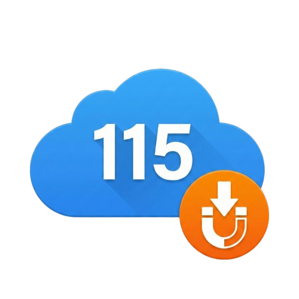

<p align="right">
  <a href="README_EN.md">🇬🇧 English</a>
</p>

<h1 align="center">
  <br>
  115 离线助手
</h1>

<p align="center">
  <strong>自动检测 magnet/ed2k 链接，一键推送到 115 网盘离线下载。</strong>
</p>

<p align="center">
  
  
  
</p>

---

## ✨ 功能特性

- 🔍 **自动检测链接** — 自动检测任意网页上的 magnet 和 ed2k 链接（可选开启）
- 📋 **剪贴板支持** — 在弹出窗口直接粘贴链接推送
- 📥 **一键推送** — 即时推送链接到 115 网盘离线下载队列
- 📁 **自定义保存路径** — 选择离线下载的保存目录
- 🗑️ **安全清理广告文件** — 识别下载附带的 HTML/TXT 和小广告视频；字幕默认保护，图片/海报与 NFO 清理默认关闭
- 📂 **自动整理视频** — 从 JavBus/JavDB 页面读取番号，下载完成后按番号重命名和整理
- 🔄 **后台任务队列** — 由扩展 service worker 持久监控 115 任务，关闭原网页后仍可继续处理
- 🧰 **后台管理与独立设置页** — 首页可直接进入后台管理标签查看日志、刷新和重试；完整设置页管理扩展名规则、清理开关和目录
- 📱 **扫码登录** — 在扩展弹窗中直接扫码登录 115 账号
- 🌐 **中英双语** — 界面支持中文和英文

## 📦 安装方法

### Chrome 应用商店（推荐）

直接从 Chrome 应用商店安装：

[](https://chromewebstore.google.com/detail/115-offline-helper/blgnjjjbmjgilkiimglodjdebcdaidgl?hl=zh-CN&authuser=0)

### 从源码用 Pixi 构建与部署

需要 Windows、Chrome 和 [pixi](https://pixi.sh/)。在仓库根目录执行：

```powershell
Copy-Item config.example.toml config.toml
```

在 `config.toml` 的 `[browser] chrome` 中填写本机 `chrome.exe` 路径，然后执行：

```powershell
pixi install
pixi run deploy
```

`pixi run deploy` 会校验扩展并将源码复制到 `dist/extension`，随后打开 `chrome://extensions/`，同时请求 Chrome 加载该编译目录。若 Chrome 已经运行而忽略了启动参数，首次安装时在扩展页开启“开发者模式”，点击“加载已解压的扩展”，选择仓库中的 `dist/extension`。

以后修改源码后再次执行 `pixi run deploy`，再点击扩展卡片上的“重新加载”即可。

### 手动安装

1. **下载扩展**

   前往 [Releases](https://github.com/gangz1o/115-offline-helper/releases/latest) 页面，下载 `115-offline-helper_v*.zip` 并解压。

   或通过 Git 克隆仓库：

   ```bash
   git clone https://github.com/gangz1o/115-offline-helper.git
   ```

2. **打开扩展管理页面**

   | 浏览器 | 地址 |
   |--------|------|
   | Chrome | `chrome://extensions/` |
   | Edge | `edge://extensions/` |

3. **开启开发者模式**

   打开页面左下角（Edge）或右上角（Chrome）的 **开发者模式** 开关。

4. **加载扩展**

   点击 **加载已解压的扩展程序**。源码方式请先运行 `pixi run build`，然后选择项目中的 `dist/extension` 文件夹；Release 压缩包则选择解压后的扩展目录。

5. **完成！**

   扩展图标会出现在工具栏中，建议点击 📌 固定方便使用。

> **💡 提示：** 更新时运行 `git pull` 拉取最新代码，然后在扩展管理页面点击 ↻ 刷新按钮即可。

> **💡 兼容性：** 本扩展基于 Manifest V3，支持所有 Chromium 内核浏览器（Chrome、Edge、Brave、Arc 等）。

## 🚀 使用说明

1. **登录** — 点击扩展图标 → **扫码登录** → 用 115 手机客户端扫描二维码。❗️❗️❗️强烈建议使用非常用客户端（如小程序端），这样不会将常用客户端挤掉线
2. **设置保存目录** — 在主页下拉框中选择，或在设置页添加自定义路径（格式：`文件夹名:CID`）。
3. **推送链接** — 两种方式：
   - **弹窗推送**：在输入框中粘贴 magnet/ed2k 链接，点击 **推送**。
   - **自动检测**：在设置中开启"自动检测链接"，浏览任意网页时自动检测并弹出一键推送确认框。

### 设置项

| 设置 | 说明 |
|------|------|
| 保存目录列表 | 按 `目录名:CID` 格式添加，每行一个 |
| 自动检测链接 | 通过内容脚本在所有页面检测链接 |
| 自动清理广告文件 | 回收明确垃圾扩展名；小视频还需满足主视频、分片、时长或广告关键词判断 |
| 扩展名规则 | 在扩展图标 → 设置 → **打开完整设置与日志** 中编辑垃圾、保护和可选清理扩展名 |
| 图片/NFO 清理 | 默认关闭；在独立设置页主动开启后才会按阈值处理 |
| 自动整理视频文件 | 优先使用页面番号，将主视频重命名为“番号.ext”，字幕尽量跟随改名，并将任务文件夹改为番号 |

> 安全策略：默认 `.url/.html/.htm/.txt/.exe/.bat/.cmd/.torrent` 会直接回收；`.srt/.ass/.ssa/.sup/.vtt` 默认保护。图片/海报和 `.nfo` 的清理默认关闭，需在独立设置页开启；若扩展名同时出现在垃圾与保护列表，保护规则优先。视频不会仅因小于阈值就删除，还会避开最大主视频和 CD1/CD2；无法确认的文件保留。

> 后台监控：推送成功后，启用自动清理或自动整理时会登记持久任务。任务状态保存在 `chrome.storage.local`，由 service worker 定期唤醒检查；弹窗主页可直接点击“后台管理”查看完整日志并重试失败任务，独立设置页用于更宽屏的规则配置。

## ❓ 常见问题

**Q: 如何获取文件夹 CID？**
> 在 [115.com](https://115.com) 网页版打开目标文件夹，查看地址栏：`https://115.com/?cid=1234567`，`cid=` 后面的数字就是 CID。

**Q: 提示未登录？**
> 点击扩展图标 → **扫码登录**，用 115 手机客户端扫码即可。❗️❗️❗️强烈建议使用非常用客户端（如小程序端），这样不会将常用客户端挤掉线

**Q: 自动检测不生效？**
> 确保在设置中开启了"自动检测链接"。浏览器会请求额外权限，请点击允许。

## 🛠️ 开发命令

```powershell
pixi install
pixi run build    # 校验并生成 dist/extension
pixi run deploy   # 构建并打开 Chrome 扩展管理页
pixi run clean    # 清理构建产物
```

源码说明见 [`src/README.md`](src/README.md)。本机的 `config.toml` 只保存 Chrome 路径，已被 Git 忽略。

## 🔒 隐私

- 所有数据通过 `chrome.storage.local` 保存在本地
- 不收集、传输或共享任何用户数据
- 仅与 `*.115.com` 域名通信
- [完整隐私政策](https://gangz1o.github.io/115-offline-helper/privacy-policy.html)

## 📄 License

[MIT License](LICENSE)
